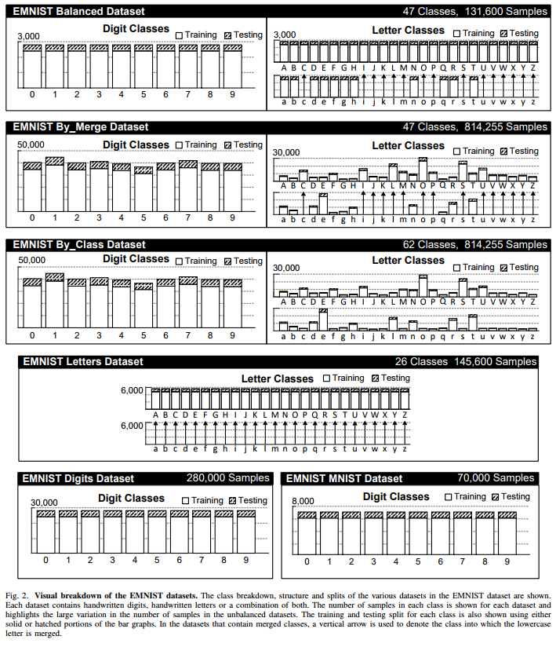

# Intelligent Systems Team Project Option B Pipeline

## Features

## GUI Interface

## Pre-Processing

## Segmentation

## Models

## Evaluation 

## How to Run the Program

## Project Structure

## Requirements

## Data Extension - EMNIST

### 1. Motivation

- MNIST is a well-known dataset and we want a dataset with more classes (digits + letters) and is directly compatitable with MNIST so that our models can be reused.
- In this project, we'll be using the 'Balanced' split from EMNIST as it's the most efficient implementation (only 3000 samples per class) and seems to yield a good enough result.

### 2. Dataset Construction and Conversion

By Class and By Merge hierachies of NIST:
- By Class has separate classes for uppercase and lowercase letters (62 classes: 10 digits + 26 uppercase + 26 lowercase) 
- By Merge merges certain confusing pairs (e.g. some uppercase/lowercase) to reduce classes to 47 total (10 digits + 37 letter classes)
- All of these images are converted to 28x28 grayscale images to match MNIST
- The conversion pipeline consists of: applying a smalle Gaussian blue, extracting box around the character, centering in a square frame with a 2-pixel border, resizing (bicubic interpolation) to 28x28

### 3. Six Dataset Splits/Variants
| split name | classes | total sample | notes |
|:---|:---:|:---:|---:|
| ByClass | 62 | 814,255 | full set but unbalanced |
| ByMerge | 47 | 814,255 | merged similar uppercase/lowcase pairs to reduce class count but unbalanced |
| Balanced | 47 | 131,600 | subset of ByMerge, equal number of samples per class |
| Letters | 26 | 145,600 | only letters (both uppercase and lowercase) |
| Digits | 10 | 280,000 | only digits and balanced
| MNIST | 10 | 70,000 | original MNIST |

### Reference:

[EMNIST: an extension of MNIST to handwritten letters](https://arxiv.org/pdf/1702.05373v1)
[Kaggle - EMNIST (Extnded MNIST)](https://www.kaggle.com/datasets/crawford/emnist/data)

> Citation:
> Cohen, G., Afshar, S., Tapson, J., & van Schaik, A. (2017). EMNIST: an extension of MNIST to handwritten letters. Retrieved from http://arxiv.org/abs/1702.05373
